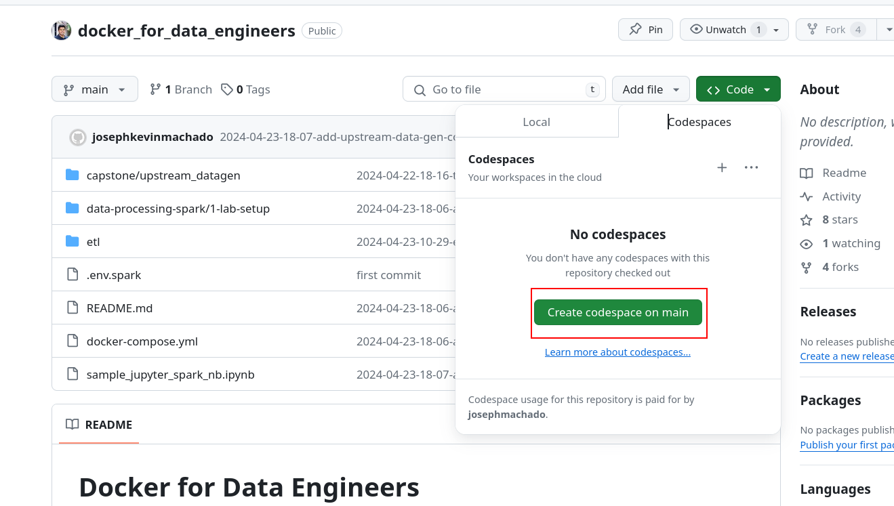
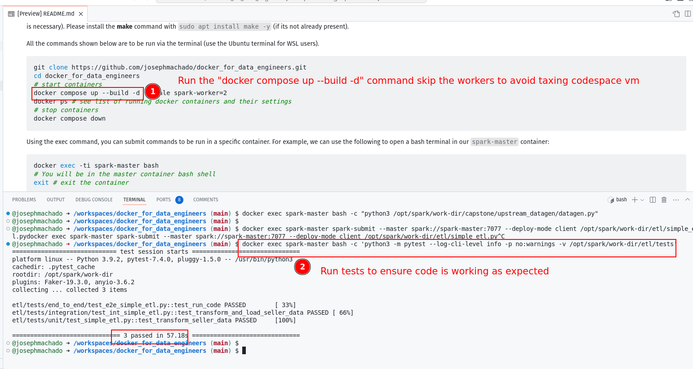

# Docker for Data Engineers

Code for blog at: https://www.startdataengineering.com/post/docker-for-de/

In order to run the code in this post you'll need to install the following:
 
1. [git version >= 2.37.1](https://github.com/git-guides/install-git)
2. [Docker version >= 20.10.17](https://docs.docker.com/engine/install/) and [Docker compose v2 version >= v2.10.2](https://docs.docker.com/compose/#compose-v2-and-the-new-docker-compose-command).

**Windows users**: please setup WSL and a local Ubuntu Virtual machine following **[the instructions here](https://ubuntu.com/tutorials/install-ubuntu-on-wsl2-on-windows-10#1-overview)**. Install the above prerequisites on your ubuntu terminal; if you have trouble installing docker, follow **[the steps here](https://www.digitalocean.com/community/tutorials/how-to-install-and-use-docker-on-ubuntu-22-04#step-1-installing-docker)** (only Step 1 is necessary). Please install the **make** command with `sudo apt install make -y` (if its not already present). 

All the commands shown below are to be run via the terminal (use the Ubuntu terminal for WSL users).

```bash
git clone https://github.com/josephmachado/docker_for_data_engineers.git
cd docker_for_data_engineers
# start containers
docker compose up --build -d --scale spark-worker=2
docker ps # see list of running docker containers and their settings
# stop containers
docker compose down
```

Using the exec command, you can submit commands to be run in a specific container. For example, we can use the following to open a bash terminal in our `spark-master` container:

```bash
docker exec -ti spark-master bash
# You will be in the master container bash shell
exit # exit the container
```

Note that the `-ti` indicates that this will be run in an interactive mode. As shown below, we can run a command without interactive mode and get an output.

```bash
docker exec spark-master echo hello
# prints hello
```

## Running a Jupyter notebook

Use the following command to start a jupyter server:

```bash
docker exec spark-master bash -c "jupyter notebook --ip=0.0.0.0 --port=3000 --allow-root"
```

You will see a link displayed with the format `http://127.0.0.1:3000/?token=your-token`, click it to open the jupyter notebook on your browser. You can use [local jupyter notebook sample to get started](./sample_jupyter_spark_nb.ipynb).

You can stop the jupyter server with ctrl + c.

## Running on GitHub codespaces

**Important**❗ Make sure you shut down your codespace instance, they can cost money !(pricing ref](https://github.com/features/codespaces)

You can run our data infra in a GitHub Codespace container as shown below.

1. Clone this repo, and click on `Code` -> `Codespaces` -> `Create codespace on main` in the GitHub repo page.
2. In the codespace start the docker containers with `docker compose up --build -d` note that we skip the num workers, since we don't want to tax the codespace VM.
3. Run commands as you would in your terminal.




**Note** If you want to use Jupyter notebook via codespace forward the port 3000 following the steps [here](https://docs.github.com/en/codespaces/developing-in-a-codespace/forwarding-ports-in-your-codespace#forwarding-a-port)
   
# Testing PySpark Applications

Code for blog at: https://www.startdataengineering.com/post/test-pyspark/

## Create fake upstream data

In our upstream (postgres db), we can create fake data with the [datagen.py](./capstone/upstream_datagen/datagen.py) script, as shown:

```bash
docker exec spark-master bash -c "python3 /opt/spark/work-dir/capstone/upstream_datagen/datagen.py"
```

## Run simple etl

```bash
docker exec spark-master spark-submit --master spark://spark-master:7077 --deploy-mode client /opt/spark/work-dir/etl/simple_etl.py
```

## Run tests

```bash
docker exec spark-master bash -c 'python3 -m pytest --log-cli-level info -p no:warnings -v /opt/spark/work-dir/etl/tests'
```
